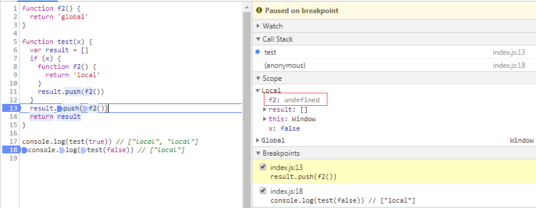

# 当心局部块函数声明笨拙的作用域

## 案例一
```javascript
function f() {
  return 'global'
}

function test(x) {
  function f() {
    return 'local'
  }
  var result = []
  if (x) {
    result.push(f())
  }
  result.push(f())
  return result
}

console.log(test(true)) // ["local", "local"]
console.log(test(false)) // ["local"]
```

## 案例二
```javascript
function f2() {
  return 'global'
}

function test(x) {
  var result = []
  if (x) {
    function f2() {
      return 'local'
    }
    result.push(f2())
  }
  result.push(f2())
  return result
}

console.log(test(true)) // ["local", "local"]
console.log(test(false)) 
// 预期：["local"]
// 实际结果：f2 is not a function
// 原因：chrome中内部函数f2被当做函数表达式，变量提升；不同浏览器存在差异

```
## 结果


## 推荐写法
```javascript
function f2() {
  return 'global'
}

function test(x) {
  var result = [], g = f2
  if (x) {
    g = function () {
      return 'local'
    }
    result.push(g())
  }
  result.push(g())
  return result
}

console.log(test(true)) // ["local", "local"]
console.log(test(false)) // ["global"]
```
